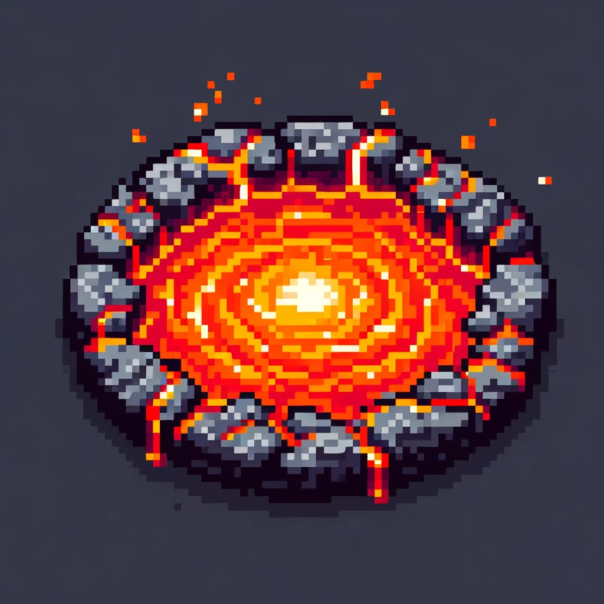

# LLaVA-Pool

<p align="center">
    
</p>

<div align="center">

**A Comprehensive Framework for Training and Fine-tuning Vision-Language Models**
</div>

## 📖 Overview

LLaVA-Pool is a powerful and flexible framework designed for training and fine-tuning Vision-Language Models (VLMs). It provides a unified interface for working with various state-of-the-art VLMs, supporting both pre-training and supervised fine-tuning workflows. With LLaVA-Pool, you can easily customize and optimize VLMs for your specific multimodal tasks.

## ✨ Key Features

- **Multiple Model Support**: Compatible with leading VLMs including Qwen2-VL, Qwen2.5-VL, LLama 3.2 Vision, Pixtral, and InternVL2.5
- **Flexible Training Methods**: Support for pre-training, supervised fine-tuning (SFT), and direct preference optimization (DPO)
- **Efficient Data Processing**: Streamlined data loading and processing pipelines for multimodal datasets
- **Distributed Training**: Built-in support for multi-GPU and multi-node training
- **Customizable Configuration**: YAML-based configuration system for easy experiment management
- **Inference Tools**: Ready-to-use inference scripts for model evaluation and deployment

## 🛠️ Installation

To install LLaVA-Pool, follow these commands:

```bash
git clone https://github.com/thisisiron/LLaVA-Pool.git
cd LLaVA-Pool
pip install -r requirements.txt
```

For optimal performance with GPU acceleration, we recommend installing flash-attention:

```bash
pip install flash-attn --no-build-isolation
```

## 📊 Supported Models

| Model | Converter | Description |
| --- | --- | --- |
| Qwen2-VL | qwen2_vl | Qwen2's vision-language model |
| Qwen2.5-VL | qwen2_vl | Qwen2.5's vision-language model |
| Llama 3.2 Vision | llama3.2_vision | Meta's Llama 3.2 with vision capabilities |
| Pixtral | pixtral | Pixtral vision-language model |
| InternVL2.5 | internvl2_5 | InternVL's 2.5 version |

## 📚 Data Preparation

LLaVA-Pool supports various data formats for training and fine-tuning. The data directory structure should be organized as follows:

```
data/
├── dataset_config.json  # Configuration for datasets
├── demo.json            # Example data format
└── demo_data/           # Example images
    ├── image1.jpg
    ├── image2.jpg
    └── ...
```

The `dataset_config.json` file defines the datasets to be used for training. Each dataset should follow the format specified in the demo.json file, which includes conversations and image references.

## 🚀 Training

### Pre-training

For pre-training a vision-language model, you can use the provided configuration files in the `examples` directory:

```bash
export PYTHONPATH=src:$PYTHONPATH
torchrun --nnodes 1 --nproc_per_node 4 --master_port 20001 src/llavapool/run.py examples/pretrain_config.yaml
```

### Supervised Fine-tuning (SFT)

For fine-tuning a pre-trained model on your specific task:

```bash
export PYTHONPATH=src:$PYTHONPATH
torchrun --nnodes 1 --nproc_per_node 4 --master_port 20001 src/llavapool/run.py examples/qwen2vl_full_sft.yaml
```

### Direct Preference Optimization (DPO)

To align your model with human preferences using DPO:

```bash
export PYTHONPATH=src:$PYTHONPATH
torchrun --nnodes 1 --nproc_per_node 4 --master_port 20001 src/llavapool/run.py examples/qwen2vl_dpo.yaml
```

DPO fine-tuning requires a dataset of preferred and rejected responses for given prompts. This alignment technique helps improve the model's response quality by learning from human preferences.

You can customize the training parameters by modifying the YAML configuration files in the `examples` directory.

## 🔍 Inference

To run inference with a trained model:

```bash
python infer.py --model_path /path/to/your/model
```

This will launch a Gradio interface for interactive testing of your model.

## 📋 Configuration

LLaVA-Pool uses YAML configuration files to define training parameters. Here's an example configuration for fine-tuning Qwen2-VL:

```yaml
### model
model_name_or_path: "Qwen/Qwen2-VL-7B-Instruct"
### method
stage: sft
do_train: true
finetuning_type: full
freeze_vision_tower: false
train_mm_proj_only: false
deepspeed: scripts/deepspeed/zero3.json
### dataset
dataset: aihub_table,aihub_chart,aihub_math,aihub_ocr,docvqa,arxivqa,ocr-vqa-200k,figureqa
template: qwen2_vl
cutoff_len: 32768
overwrite_cache: true
preprocessing_num_workers: 80
### output
output_dir: output/qwen2_vl-7b/full/ko-en_docai_qwen2vl_train-vit_cl8192_wodocvqa25k
logging_steps: 100
save_steps: 20000
overwrite_output_dir: true
### train
per_device_train_batch_size: 1
gradient_accumulation_steps: 8
learning_rate: 1.0e-5
num_train_epochs: 1
lr_scheduler_type: cosine
warmup_ratio: 0.1
bf16: true
```

## 🤝 Contributing

Contributions to LLaVA-Pool are welcome! Please feel free to submit a Pull Request.

## 📄 License

This project is licensed under the Apache License 2.0. See the [LICENSE](LICENSE) file for more details.

## 🔗 References

This repository was built with inspiration from:

- [LLaMA-Factory](https://github.com/hiyouga/LLaMA-Factory)
- [LLaVA-NeXT](https://github.com/haotian-liu/LLaVA)
- [InternVL](https://github.com/OpenGVLab/InternVL)

## 📧 Contact

For questions or feedback, please open an issue on GitHub.
